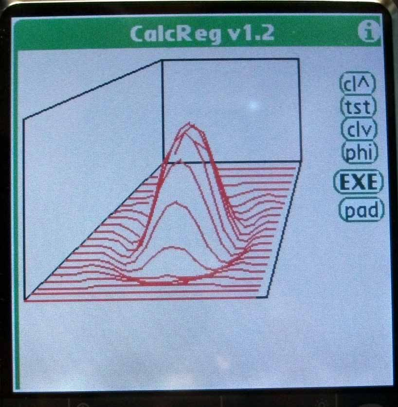
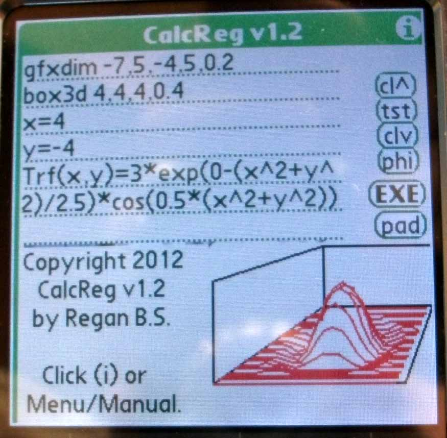
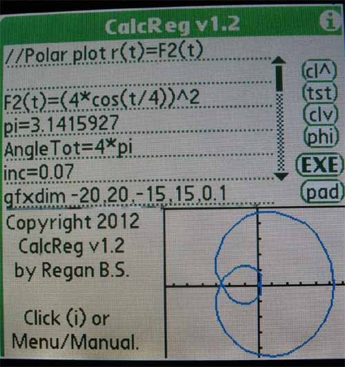

# calcregsrc
The sources of calcreg software - This is a Matlab 'like' software with its own interpreted language coded in C for Win API.

This software has been first designed on PALMOS, and was used by the author as a graphical and programmable calculator.

The idea at start was to be able to have a lab and connect to audio or electronic cards such as oscilloscope and perform full mathematical studies on graphs.

Then the program has been ported on PC windows under Win API and implemented further mode to include full Matrice calculation with complexe numbers, potential to make Quantum calculation, and 3D graphs as well.

Audio creation and filter butterworth analysis as been done with this software.
A Lot can be done further.

Here are a few screenshots of the display on PalmOS : 

  
   
   

