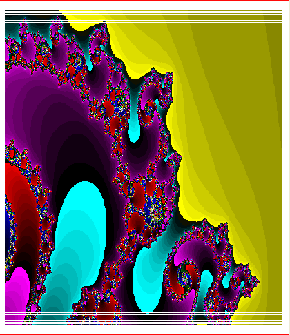
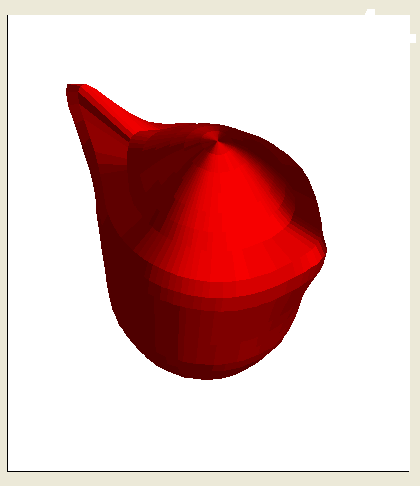

# calcregsrc
The sources of calcreg software - This is a Matlab 'like' software with its own interpreted language coded in C for Win API.
see InstructionDoc directory for manual instructions.

It is a fully functionnal software designed for Windows win32api (Winxp, win7)
can be implemented to run on linux, meaning sound, serial, graphics layer has to be created.

Audio sounds has been computed, 3D modeling Matrix object, and filter butterworth analysis as been done with this software.
A Lot can be done with it.

<table>
  <tr>
    <td></td>
    <td></td>
  </tr>
</table>

